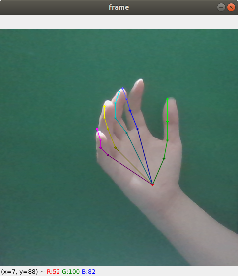
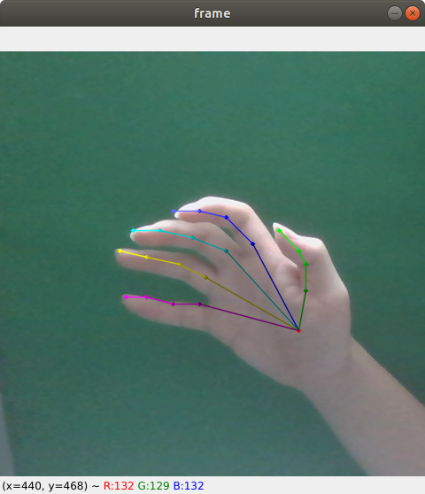
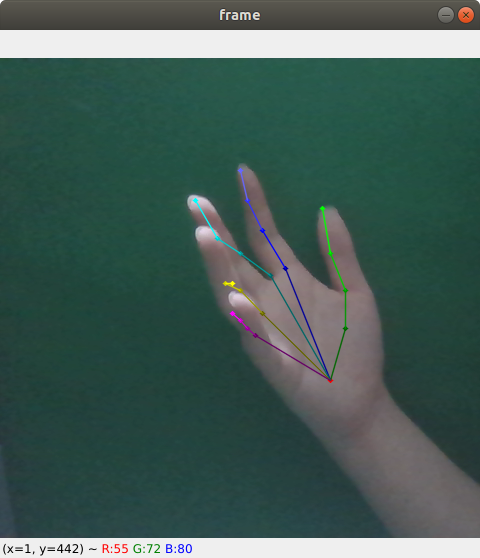
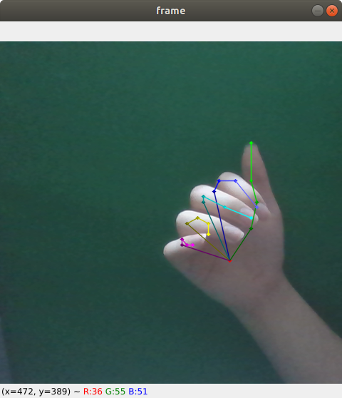
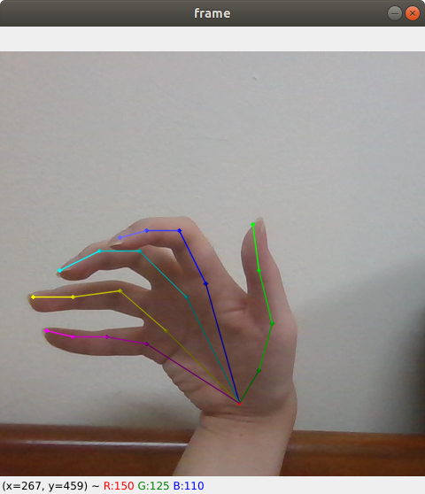

# Hand Pose Estimation

<p align="center">
  
  
  
  
  
  
</p>

## Setup (Ubuntu 18 Python3.8)
- Install dependencies
```
pip install -r requirements.txt
```
- For RTX 3070
```
pip3 install torch==1.10.1+cu113 torchvision==0.11.2+cu113 torchaudio==0.10.1+cu113 -f https://download.pytorch.org/whl/cu113/torch_stable.html
```
- Setup the dataset in the folder `data/` 

## Train
- Train blazenet
```
python3 train.py --cfg cfgs/blazenet_freihand_v1.yml
```
- Sample dataset
```
python3 train.py --cfg cfgs/blazenet_freihand_v1.yml --mode sample
```
- Check dataset preprocessing
```
python3 train.py --cfg cfgs/blazenet_freihand_v1.yml --mode check
```
- Save dataset preprocessing 
```
python3 train.py --cfg cfgs/blazenet_freihand_v1.yml --mode visualize
```
- Validate model inference
```
python3 train.py --cfg cfgs/blazenet_freihand_v1.yml --mode validate
```