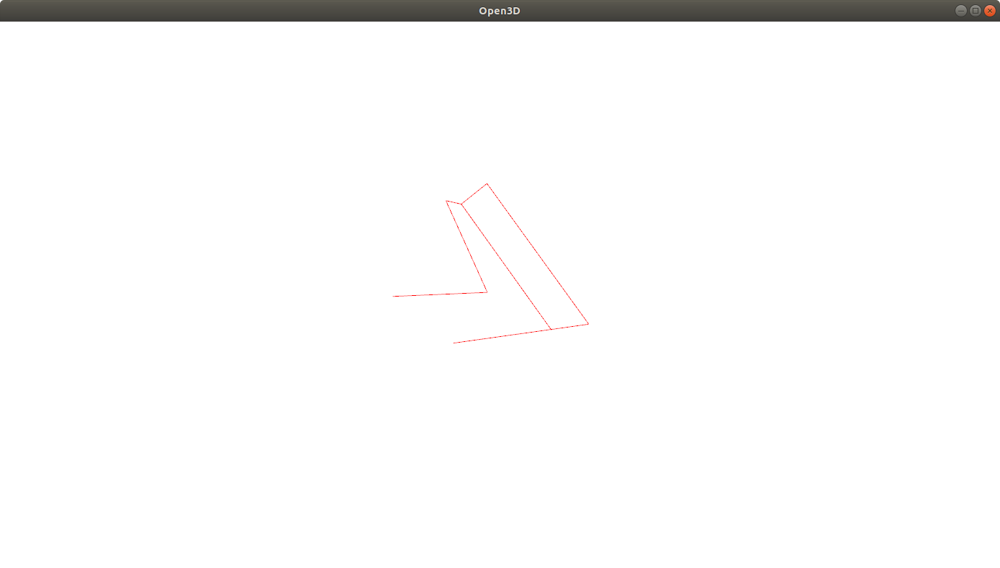

# Realsense 3D Pose Dataset

<p align="center">
  
</p>

## Setup (Ubuntu 18 Python3.6)
- Install Python3.6
```
sudo apt install python3-pip python3-dev
```
- Install dependencies
```
pip3 install --upgrade pip
pip3 install -r requirements.txt
```

## Run
- Run GUI
```
python3 main.py
```
